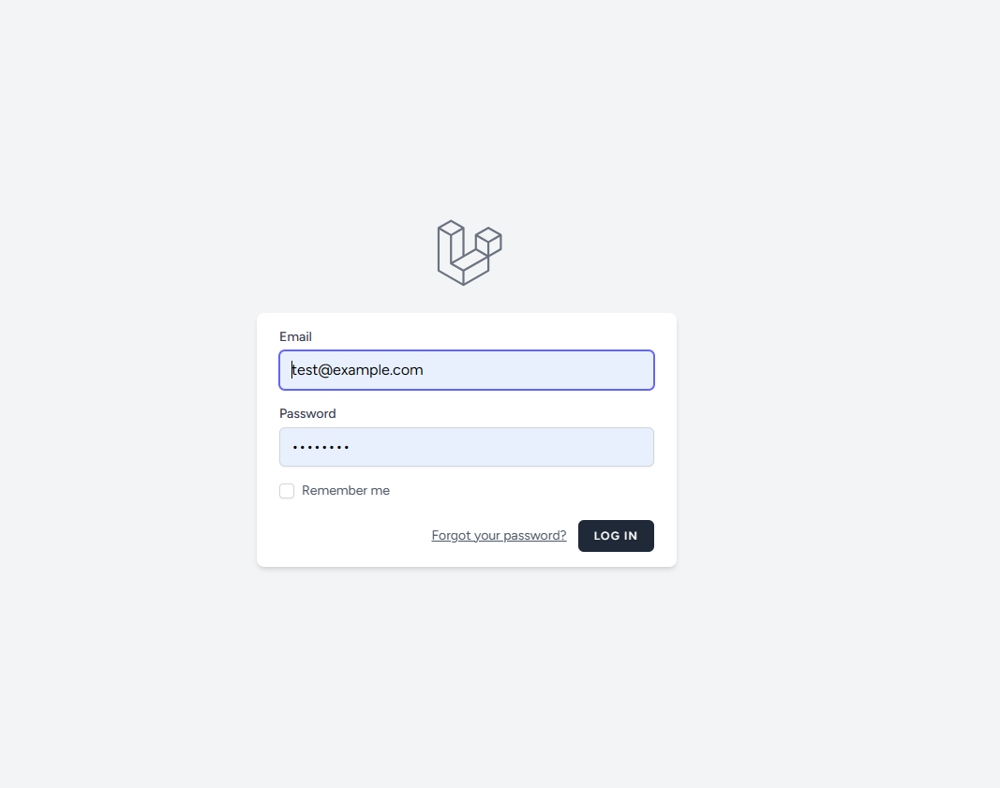

# Http5225-assignment3

## CMS- Laravel Assignment

## Installation
1. Clone this repository: git clone https://github.com/abiasV/Http5225-assignment3.git
2. Navigate to the project directory: cd Http5225-assignment3

## Live Website

![View Website:])
