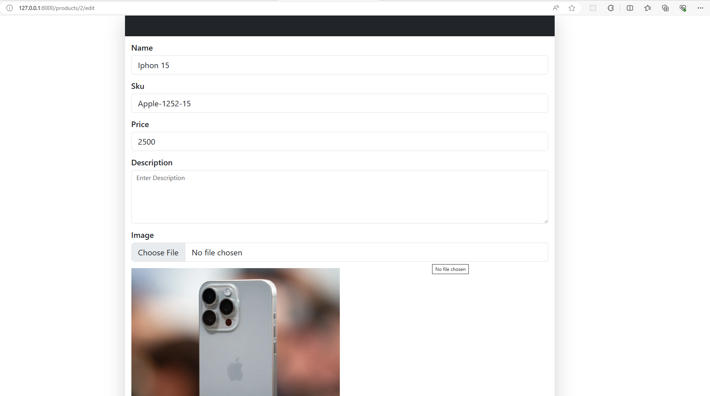

# Http5225-assignment3

## CMS- Laravel Assignment

## Installation
1. Clone this repository: git clone https://github.com/abiasV/Http5225-assignment3.git
2. Navigate to the project directory: cd Http5225-assignment3

## User Flow
## Live Website

### Login Screen

### Dashboard (User Test)

### Admin can see all the items

### Admin can create new item

### Product added successfully

### Admin can edit specific item

### Product updated successfully

### Admin can delete specific item

### Product deleted successfully

